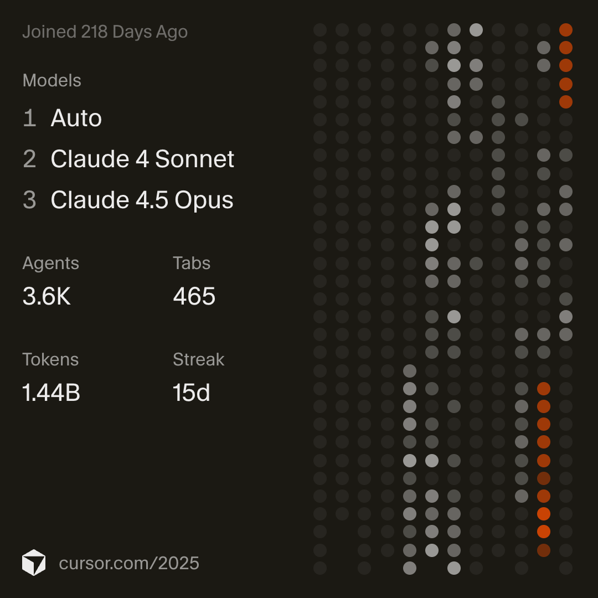
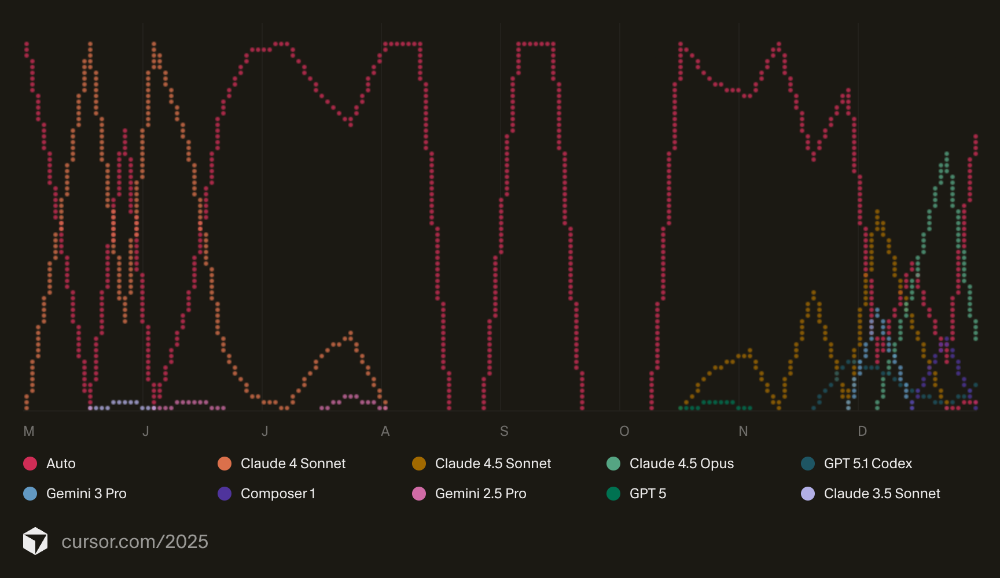

<h1>💫 About Me</h1>
<h3>Final Year AI Student @ King's College London</h3>

<i>Building the next generation of Agentic Systems</i>

 
<table>
<tr>
<td width="60%" valign="top">
<h2>👨‍💻</h2>
<b>🛡️ Focus Areas:</b> 
Agentic AI initiatives & Autonomous Systems + Video and Content Understanding
  
<b>⚡ Fun fact:</b> 
I've lived in 4 countries across 4 continents 🌍
  
<b>🌐 Connect:</b> 

</td>
<td width="40%" valign="center">

</td>
</tr>
</table>
 

<h3>🚀 Cursor Wrapped 2025</h3>

<i>It's the intution all that usage builds what I find greatly valuable building and designing systems. Currently I am mainly on Claude Code more, going through millions of tokens a day</i>

